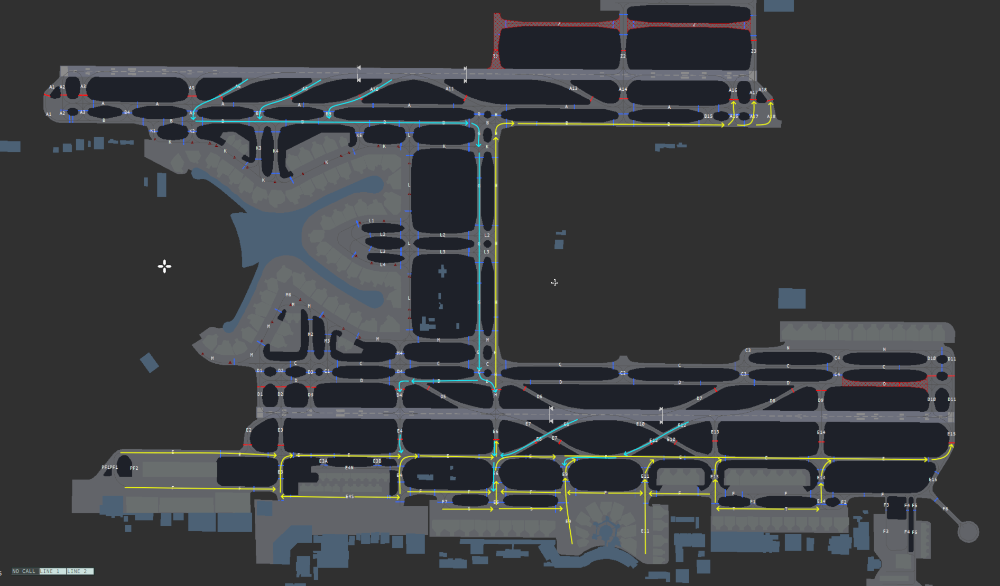
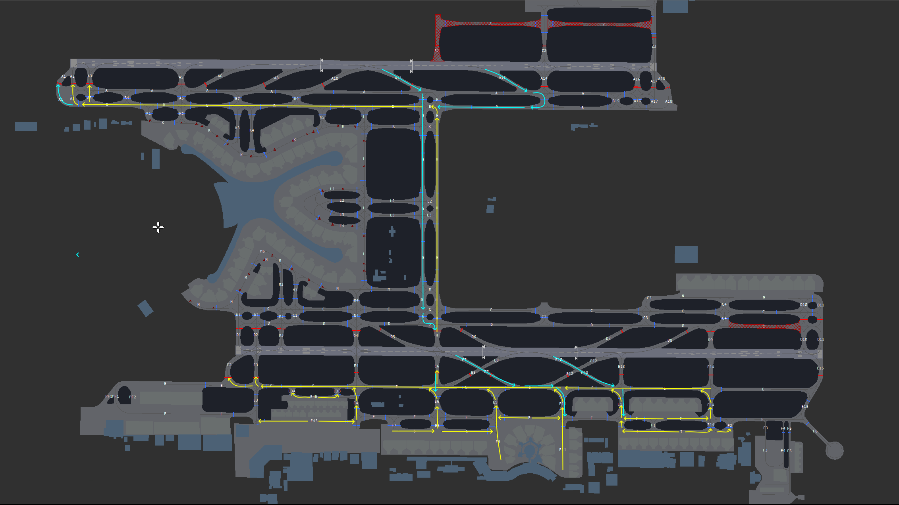

# 6. Appendix - Taxi Diagrams
## 6.1 Use of Diagrams
Yellow lines indicate departure taxi routes. Blue lines indicate arrival taxi routes.

Commonly used intermediate holding points are shown in white. Runway holding points are shown in red.

Taxiways with a red background are currently closed as they are under construction

Caution shall be used with certain types of aircraft, especially code F (A380/747-8) aircraft. 

## 6.2 General configuration
### 6.2.1 Runway 31L/R Configuration
<figure markdown>

</figure>

### 6.2.2 Runway 13L/R Configuration
<figure markdown>

</figure>

### 6.2.3 Code C/E/F Limitations
<figure markdown>

</figure>