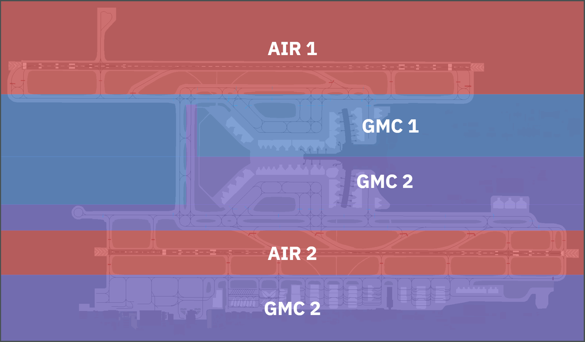

# 7. Appendix - Areas of Responsibility
## 7.1 Use of Diagrams
Areas indicated in a red solid colour are the sole responsibility of the the AIR controller. Those indicated in a blue & violet solid colour are the sole responsibility of the GMC controller. GMC shall expect traffic to only be handed off once at the boundary of these areas. Transfer of control shall be initiated by GMC before aircraft reach the boundary of these areas.

## 7.2 General
<figure markdown>

</figure>