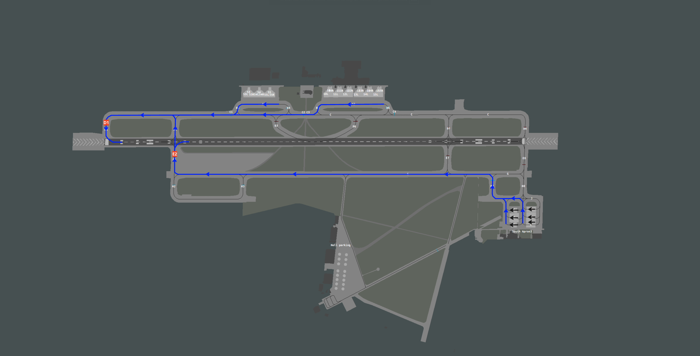
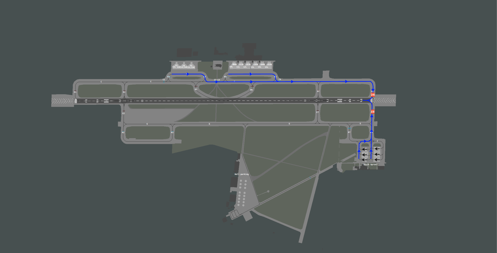
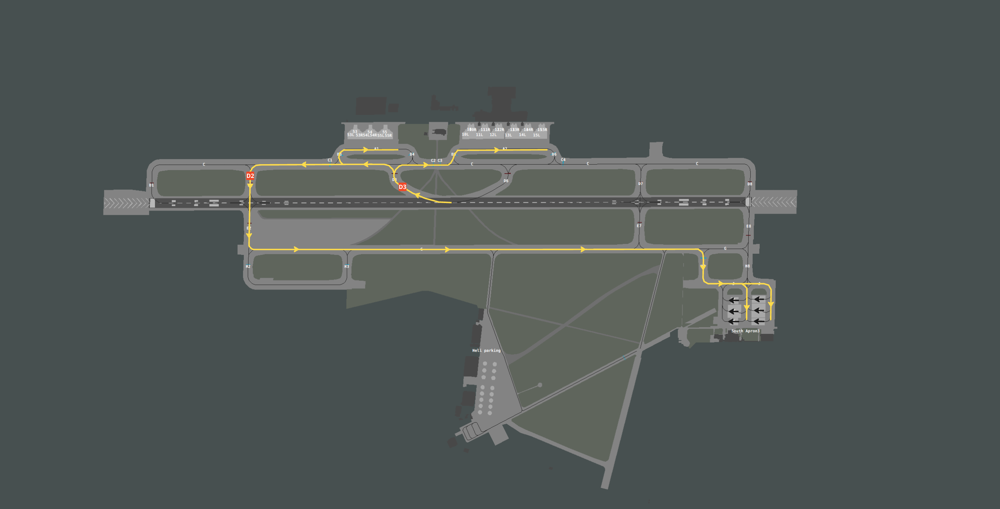

# 6. Appendix - Taxi Diagrams
## 6.1 Use of Diagrams
Blue lines indicate departure taxi routes. Yellow lines indicate arrival taxi routes.

Commonly used intermediate holding points are shown in white. Runway holding points are shown in red.

## 6.2 Runway 07
### 6.2.1 Departures
<figure markdown>

</figure>

### 6.2.2 Arrivals
<figure markdown>

</figure>

## 6.3 Runway 25
### 6.3.1 Departures
<figure markdown>

</figure>

### 6.3.2 Arrivals
<figure markdown>

</figure>