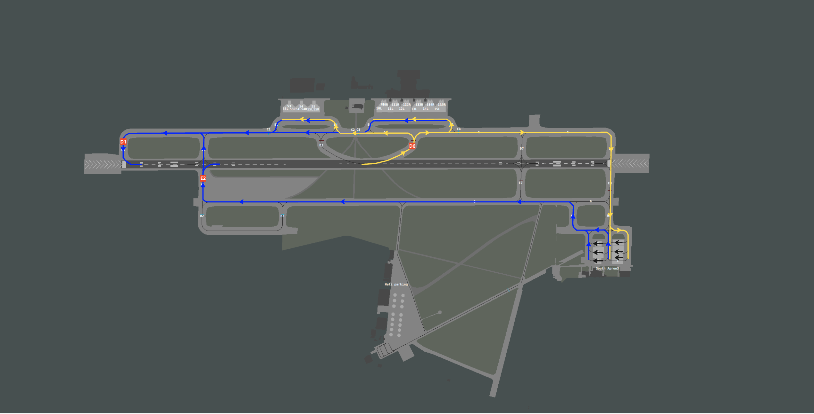
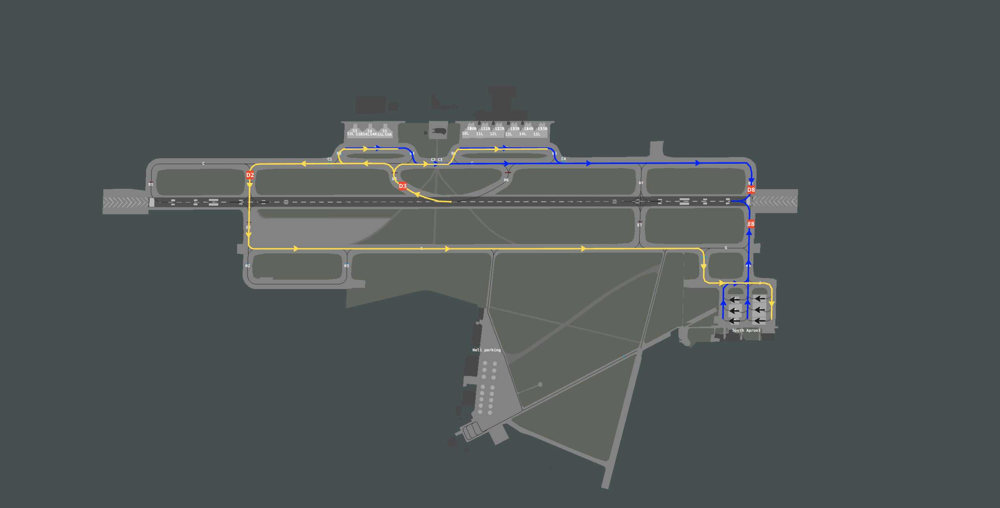

# 6. Appendix - Taxi Diagrams
## 6.1 Use of Diagrams
Blue lines indicate departure taxi routes. Yellow lines indicate arrival taxi routes.

Commonly used intermediate holding points are shown in white. Runway holding points are shown in red.

Pink indicates areas not available in some sceneries and shall not be used unless requested.

Taxiways with a red background are not code F (A380/B747-8) compatible.

## 6.2 Runway 07
<figure markdown>

</figure>

## 6.3 Runway 25
<figure markdown>

</figure>