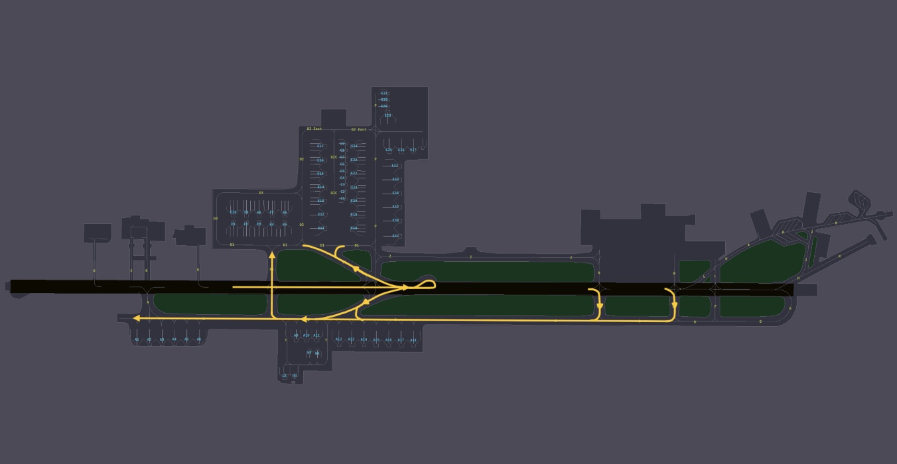
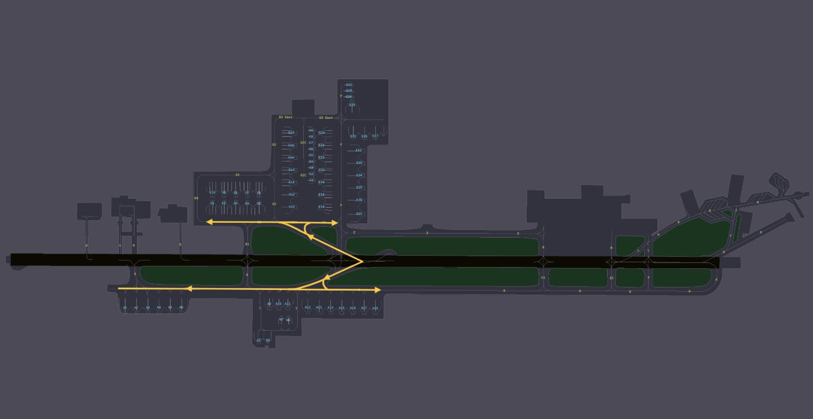

# Doha
## Airport Overview
### Information

<figure markdown>

</figure>

| IATA | ICAO | Charts | NOTAM(s) |
|:----:|:----:|:------:|:----------:|
| DIA  | OTBD | [Qatar eAIP](https://www.aim.gov.qa/eAIP1.html)    | |

Doha International Airport is located in Doha, Qatar. It served as Qatar's primary commercial international airport until the opening of Hamad International Airport on 27 May 2014. Although regular commercial traffic has ceased, the airport and its existing runway are still utilized by the Qatar Emiri Air Force, Qatar Amiri Flight, Rizon Jet, Gulf Helicopters, and Qatar Aeronautical College. Additionally, it functions as a state/diplomatic airport, accommodating both Qatar Amiri Flight and state visit flights. On 15 September 2022, the airport resumed commercial flights for select airlines to manage increased traffic for the 2022 FIFA World Cup hosted by Qatar in November.

### Charts & Scenery
Pilots can access the latest charts through the following sources: [Chartfox (Free, VATSIM login required)](https://chartfox.org/), [Qatar eAIP](https://www.aim.gov.qa/eAIP1.html), or [Navigraph (Subscription required)](https://navigraph.com/).

| Simulator      | Freeware | Payware   |
|----------------|----------|-----------|
| MSFS           |          |           |
| X-Plane        |          |           |
| Prepar3D V4/V5 |          |           |

### Air Traffic Control positions
| Login Code |  Radio Callsign  | Frequency | Area of Responsibility                                            |
|:----------:|:----------------:|:---------:|-------------------------------------------------------------------|
| OTBD_GND   | Doha Ground      | 121.925   |  All IFR & VFR clearances, pushback, start-up & taxi clearances   |
| OTBD_TWR   | Doha Tower       | 118.900   |       Runway 33/15                                                |                        
 DOH_F1_APP |       Doha Director      |  119.400  |                                                                    Final Approach Sequencing, Runway 16L/34R (OTHH)                                                                    |
| DOH_F2_APP |       Doha Director      |  124.050  |                                                                    Final Approach Sequencing, Runway 16R/34L (OTHH)                                                                    |
| DOH_F3_APP |       Doha Director      |  123.875  |                                                                     Final Approach Sequencing, Runway 15/33 (OTBD)                                                                     |
| DOH_A1_APP |       Doha Approach      |  124.775  |                                                                                      Approach East                                                                                     |
| DOH_A2_APP |       Doha Approach      |  119.725  |                                                                                      Approach West                                                                                     |
| DOH_R1_APP |        Doha Radar        |  121.100  |                                                                                       Radar North                                                                                      |
| DOH_R2_APP |        Doha Radar        |  120.675  |                                                                                       Radar South                                                                                      |
| OTDF_1_CTR |       Doha Control       |  135.725  |                                                                                      Control North                                                                                     |
| OTDF_2_CTR |       Doha Control       |  132.975  |                                                                                      Control South                                                                                     |

!!! Warning
    It's crucial that you pay close attention to the frequency you're being transferred to. Do not attempt to guess the next frequency, and never switch frequencies without explicit instructions from the controller. Auto-handoffs are issued with the take-off clearance at Doha-Hamad International. If you're unsure, don’t hesitate to ask for the frequency again!
## Departing Traffic
#### Flight Planning: Standard Instrument Departure (SID)
Controllers will assign a Standard Instrument Departure (SID) based on the first waypoint in your flight plan to guide you out of the Doha Terminal Maneuvering Area (TMA). Refer to the table below to determine the expected SID. If your waypoint is not listed, ensure your AIRAC cycle is up to date. If using an outdated AIRAC, notify the controller promptly so an RNAV radar-vectored departure or an omnidirectional departure can be arranged.

<table><thead>
  <tr>
    <th>FIX</th>
    <th colspan="2">RUNWAY</th>
  </tr></thead>
<tbody>
  <tr>
    <td></td>
    <td>15</td>
    <td>33</td>
  </tr>
  <tr>
    <td><b>ALSEM</b></td>
    <td>3S</td>
    <td>3N</td>
  </tr>
  <tr>
    <td><b>ALVEN</b></td>
    <td>3S</td>
    <td>3N</td>
  </tr>
  <tr>
    <td><b>BUNDU</b></td>
    <td>3S</td>
    <td>3N</td>
  </tr>
  <tr>
    <td><b>DATRI</b></td>
    <td>1S</td>
    <td>1N</td>
  </tr>
  <tr>
    <td><b>KUPRO</b></td>
    <td>1S</td>
    <td>1N</td>
  </tr>
  <tr>
    <td><b>LUBET</b></td>
    <td>2S</td>
    <td>2N</td>
  </tr>
  <tr>
    <td><b>PATOM</b></td>
    <td>3S</td>
    <td>3N</td>
  </tr>
  <tr>
    <td><b>TULUB</b></td>
    <td>2S</td>
    <td>2N</td>
  </tr>
  <tr>
    <td><b>ULIKA</b></td>
    <td>1S</td>
    <td>1N</td>
  </tr>
  <tr>
    <td><b>VAXIN</b></td>
    <td>3S</td>
    <td>3N</td>
  </tr>
</tbody></table>

### Getting your clearance
Departing aircraft shall contact Doha Ground **10 minutes prior to their estimated off block time (EOBT)** and pass the following information:
<ul>
    <li>Aircraft Callsign</li>
    <li>Aircraft Type</li>
    <li>Parking Stand</li>
    <li>Requested Flight Level</li>
    <li>Destination</li>
</ul>

#### Datalink Clearance (DCL)
The preferred method for obtaining your clearance is through datalink. To request clearance via Hoppie datalink, send your request to **OTHH**. Please note that logging on to the station is not required. No readback is necessary.

#### Voice Clearance
At Doha, if datalink clearances are unavailable, voice clearances will be provided. These will be brief, covering only your Standard Instrument Departure (SID), initial climb, and squawk code. Ensure you have the latest departure ATIS information before proceeding.

!!! example
    **Pilot**: "Doha Ground, QQE990, Gulfstream 650, information X, stand B3, requesting FL310, to Dubai."

    **Controller**: "QQE990, Doha Ground, information X correct, cleared to Dubai via the  departure, climb via the SID to altitude 3000ft, squawk 2613."

    **Pilot**: "Cleared to Dubai via the ####### departure, climb via the SID to altitude 3000ft, squawk 2613, QTR6M."

    **Controller**: "QTR6M, readback correct, QNH 1016, report ready for pushback."
  
### VFR Helicopter Operations
#### Visual Reporting Points
| VFR Reporting Point|    Designator   |
|:------------------:|:---------------:|
|      AL HAZM       |       HZM       |
|      ASPIRE        |       ASP       |
|      BAHAR         |       BHR       |
|    BANANA EAST     |       BNE       |
|     BAY-POINT      |       BAY       |
|      BEACH         |       BCH       |
|      BOAT          |       BOT       |
| CENTRAL ROUNDABOUT |       CRA       |
|        DHOW        |       DOW       |
| DOHA FESTIVAL CITY |       DFC       |
|    EASTERN EDGE    |       ESE       |
|        EZDAN       |       EZD       |
|       HAMAMA       |       HMM       |
|   INTERCEPT POINT  |       INT       |
|       IZBAH        |       IZB       |
|    LUSAIL NORTH    |       LSN       |
|        MAJD        |       MJD       |
|        MINA        |       MIN       |
|       MORJAN       |       MOR       |
|     NORTH MALL     |       NML       |
|  NORTH ROUNDABOUT  |       NRA       |
|   ORANGE HOLD 16   |      OH 16      |
|   ORANGE HOLD 34   |      OH 34      |
|      RADISSON      |       RDS       |
|        SBAQ        |       SBQ       |
|      SEA-POINT     |       SEA       |
|  SOUTH ROUNDABOUT  |       SRA       |
|       THUMAMA      |       THM       |
|       TURTLE       |       TTL       |
|        ZULU        |       ZUL       |

<figure markdown>
  <figcaption>Helicopter Route VRPs</figcaption>
</figure>

#### Standard VFR departure and arrival routes for helicopters
VFR departure and arrival routes for helicopters are split in two:
  - Departures/Arrivals at OTBD, crossing OTHH and;
  - Departures/Arrivals at OTBD.

<table><thead>
  <tr>
    <th>Runway</th>
    <th>Name</th>
    <th>Description</th>
  </tr></thead>
<tbody>
  <tr>
    <td rowspan="2">RWY 15</td>
    <td rowspan="2">ORANGE ROUTE 15</td>
    <td>Departure:

After departure RWY 15, turn left towards CRA and climb to cross CRA maintaining 1000 FT. Contact Hamad TWR West on Freq 118.025 MHz once East of OTBD RWY 15. From CRA, route to BCH and Hold, remaining clear of final approach path OTBD RWY 15 and OTHH RWY 16R whilst awaiting crossing clearance from OTHH ATC. When cleared, cross North of threshold OTHH RWY 16R/RWY 16L and route towards BAY. After BAY, route OH 16 maintaining 1000 FT. After OH 16, climb to 1500 FT and route to ESE.</td>
  </tr>
  <tr>
    <td>Arrival:

Enter the CTR via ESE maintaining 500 FT. From ESE, route OH 16, BAY to hold, awaiting instructions from OTHH ATC. When cleared, cross north of threshold. Once West of OTHH RWY 16R, contact OTBD ATC Freq. 118.900 MHz and follow joining instructions.</td>
  </tr>
  <tr>
    <td rowspan="2">RWY 33</td>
    <td rowspan="2">ORANGE ROUTE 33</td>
    <td>Departure:

After departure RWY 33, turn right towards CRA and climb to cross CRA maintaining 1000 FT. Contact Hamad TWR West on Freq  118.025 MHz once East of OTBD RWY 33. From CRA, route to SRA and Hold, remaining clear of final approach path OTBD RWY 33 and OTHH RWY 34L whilst awaiting crossing clearance from OTHH ATC. When cleared, cross South of threshold OTHH RWY 34L/RWY 34R and route towards SEA. After SEA, route OH 34 maintaining 1000 FT. After OH 34, climb to 1500 FT and route ESE.</td>
  </tr>
  <tr>
    <td>Arrival:

Enter the CTR via ESE maintaining 500 FT. From ESE, route OH 34, SEA to hold, awaiting instructions from OTHH ATC. When cleared, cross south of threshold. Contact OTBD ATC Freq. 118.900 MHz once west of OTHH RWY 34L and follow joining instructions.</td>
  </tr>
</tbody></table>
<figure markdown>
  <figcaption>Table 1-1: Helicopters departing to and/or arriving at OTBD, crossing OTHH</figcaption>
</figure>

!!! note "Suspension of Orange Route"
    1. The Orange route shall be suspended when the cloud ceiling is below 2000 FT and/ or visibility is less than 3500 M.
    2. The Orange route shall be suspended during peak arrival periods and IPO.
    3. The OTHH Supervisor may for any other valid reasons suspend the Orange Route.
    4. When the route is suspended, the OTHH ATCO Supervisor shall inform OTBD Tower, the GHC then shall be informed immediately. Best practice is to provide a minimum of
    5. 15 minutes’ notice to GHC.

<table><thead>
  <tr>
    <th>Runway</th>
    <th>Name</th>
    <th>Description</th>
  </tr></thead>
<tbody>
  <tr>
    <td rowspan="2">RWY 15 and RWY 33</td>
    <td rowspan="2">TURTLE ROUTE (TTL)</td>
    <td>Departure:

After departure RWY 15/33, route direct RDS and climb to 1500 FT. After RDS, route EZD, NML, DFC, LSN and exit via TTL.</td>
  </tr>
  <tr>
    <td>Arrival:

Enter the CTR via TTL maintaining 1000  FT. After TTL, route LSN, DFC, NML, EZD, RDS. After RDS, follow instructions from OTBD ATC.</td>
  </tr>
  <tr>
    <td rowspan="2">RWY 15 and RWY 33</td>
    <td rowspan="2">BOAT ROUTE (BOT) (This route subject to ATC approval)</td>
    <td>Departure:

After departure OTBD turn to THM climbing 1500 FT, route to ASP, HMM, SBQ to exit via BOT.</td>
  </tr>
  <tr>
    <td>Arrival:

Enter the CTR via BOT, maintaining 1000 FT and route to SBQ, HMM, then climb 1500 FT and route to ASP, follow instructions from OTBD ATC.</td>
  </tr>
   <tr>
    <td rowspan="2">RWY 15 and RWY 33</td>
    <td rowspan="2">DHOW ROUTE (DOW)</td>
    <td>Departure:

After departure RWY 15/33, route direct THM and climb to 1500 FT. After THM, route IZB, MIN, BHR, DOW.</td>
  </tr>
  <tr>
    <td>Arrival:

Enter the CTR via DOW maintaining 1000 FT. After DOW, route BHR, MIN, IZB, THM. After THM, follow instructions from OTBD ATC.</td>
  </tr>
   <tr>
    <td rowspan="2">RWY 15 and RWY 33</td>
    <td rowspan="2">MORJAN ROUTE (MOR)</td>
    <td>Departure:

After departure RWY 15/33, route direct THM and climb to 1500 FT. After THM, join via IZB at 500 FT. After IZB, route SEF, INT, and exit via MOR.</td>
  </tr>
  <tr>
    <td>Arrival:

Enter the CTR via MOR maintaining 500 FT. After MOR, route INT, SEF, and IZB to climb 1000 FT to THM. After THM, follow instructions from OTBD ATC.</td>
  </tr>
</tbody></table>
<figure markdown>
  <figcaption>Table 1-2: Helicopters arriving and departing OTBD.</figcaption>
</figure>

### VFR Civil Fixed Wing Aircraft Operations
#### Visual Reporting Points

| VFR Reporting Point|    Designator   |
|:------------------:|:---------------:|
|       ALPHA        |       ALF       |
|      AL HAZM       |       HZM       |
|      ASPIRE        |       ASP       |
|      THUMAMA       |       THM       |
|      RADISSON      |       RDS       |
| CENTRAL ROUNDABOUT |       CRA       |
|      SHAMAL        |       SML       |
|       SOFIA        |       SOF       |
|    SOUTH POINT     |       SPT       |
|        ZULU        |       ZUL       |
<figure markdown>
  <figcaption>Civil Fixed Wing Aircraft Route VRPs</figcaption>
</figure>

#### Standard VFR departure and arrival routes for Civil Fixed Wing Aircraft
VFR departure and arrival routes for Civil Fixed Wing Aircraft to the North at OTBD.

<table><thead>
  <tr>
    <th>Runway</th>
    <th>Name</th>
    <th>Description</th>
  </tr></thead>
<tbody>
  <tr>
    <td rowspan="1">RWY 33</td>
    <td rowspan="1">ASPIRE 33 Visual Departure</td>
    <td>Climb straight ahead to 700 FT, turn to the West and remain clear of prohibited area OTP45; route direct to ASP then direct to SOF; then direct to SML. Climb as instructed by ATC to 1500 FT.
</td>
  </tr>
  <tr>
    <td rowspan="1">RWY 15</td>
    <td rowspan="1">ASPIRE 15 Visual Departure</td>
    <td>Climb straight ahead to 700 FT turn to the West before the upwind end of RWY 15; route direct to THM, direct to ASP, direct to SOF then direct to SML. Climb as instructed by ATC to 1500 FT.</td>
  </tr>
</tbody></table>
<figure markdown>
  <figcaption>Table 2-1: Civil Fixed Wing Aircraft departing OTBD to the North</figcaption>
</figure>

<table><thead>
  <tr>
    <th>Runway</th>
    <th>Name</th>
    <th>Description</th>
  </tr></thead>
<tbody>
  <tr>
    <td rowspan="1">RWY 33</td>
    <td rowspan="1">ASPIRE 33 Visual Arrival</td>
    <td>From SML, route direct to SOF traffic must be 2000 FT at SOF. Then route direct to ASP and hold over ASP as required by ATC. From ASP, route direct to ZUL if requested. Hold at ZUL at 2000 FT. From ZUL, route direct to THM and descend as instructed by ATC. Hold overhead THM at 1500 FT. When instructed by ATC, route for final approach RWY 33.</td>
  </tr>
  <tr>
    <td rowspan="2">RWY 15</td>
    <td rowspan="2">ASPIRE 15 Visual Arrival</td>
    <td>From SML, route direct to SOF. Traffic must be 2000 FT by SOF, then route direct to ASP and hold over ASP as required by ATC. When cleared by ATC, proceed to VLG and descend to 1500 FT.</td>
  </tr>
</tbody></table>
<figure markdown>
  <figcaption>Table 2-2: Civil Fixed Wing Aircraft arriving OTBD from the North</figcaption>
</figure>

!!! note Note 1: Aircraft to contact Doha TWR at SML for inbound clearance.
    Note 2: If more than two aircraft requesting to return to Doha from General Flying Area, and they will be required to Hold overhead ZUL for RWY 33 or VLG for RWY 15,        succeeding aircraft will be advised to remain clear of the CTR and standby for joining instruction. Only one aircraft may hold at any one time over ZUL and VLG              respectively. No Holding allowed overhead ASP.
    Note 3: VFR traffic arriving on the ASP arrival are independent of OTHH IFR traffic.
    Note 4: Aircraft proceeding to right base RWY 15 from VLG will maintain 1500 FT until established on final approach to avoid infringing the restricted area over the Amiri Diwan. After establishing the approach, touchdown may be expected approximately abeam intersection TWY Q, with roll-out and vacation at intersection TWY B or TWY B1.
    Note 5: Advanced students or instructors may be able to accomplish touchdown and roll-out earlier than the above, but no attempt should be made to request this from the pilot.

### Push & Start
Once clearance delivery releases you to the designated ground frequency, pilots may request push and start clearance. Upon initial contact, the ground controller may provide various types of pushback instructions. Pilots must ensure they can comply with these instructions; if unable, they must inform the ground controller.

Pushback clearances will specify a direction to face, such as West or East, and a particular taxiway to push onto.

!!! example
    **Controller**: "QQE990, push and start is approved face south onto taxiway D1."

!!! warning
    If pilots are unable to commence pushback within 2-3 minutes, the pushback clearance may be revoked, and slot times will be recalculated.

### Taxi
#### Standard Intersection Departures
For the purposes of takeoff performance planning the standard departure taxiways are:

- **Runway 15:** A
- **Runway 33:** F, G

Crews should base their performance calculations on departure from standard departure points from the notified runway in use if there is no restriction to payload.

ATC may tactically use a different departure point nearer the runway end based on the traffic situation.

#### Runway 15/33 Configuration
##### Departures, Runway 15
<figure markdown>

</figure>

##### Departures, Runway 33
<figure markdown>

</figure>

### Take-off
#### Minimum Runway Occupancy
On receipt of a line-up clearance pilots shall ensure, complying with safety and standard operating procedures, that they are able to line-up on the runway as soon as the preceding aircraft has commenced take-off roll.

Wherever possible, pilots are encouraged to conduct a rolling takeoff to minimise runway occupancy time.

## Arriving Traffic
### STAR Assignment
STAR assignments are based on the waypoint at which you enter the Doha Terminal Maneuvering Area (TMA). The table below outlines the possible STARs for each entry point. ATC will assign the appropriate STAR depending on traffic conditions, with a preference for the shortest available routing whenever possible.

!!! note
    It is essential to highlight that the following arrival procedures are applicable to both Doha (OTBD) and Hamad (OTHH) airports. These procedures are not airport-specific.  

    Aircraft can be sequenced on any of the STARs that guide them either to the east or west downwinds, depending on sector capacity.

#### 3.1.2.1 Doha 15 / Hamad 16s
| Procedure |        Type        | Length | Downwind |
|:---------:|:------------------:|:------:|:--------:|
|  ALKAN1F  |      Trombone      |  Long  |   West   |
|  ALKAN1H  | Direct to Downwind |  Short |   East   |
|  ALKAN1P  |      Trombone      |  Long  |   East   |
|  LAEEB1F  | Direct to Downwind |  Short |   West   |
|  LAEEB1K  |      Trombone      |  Long  |   West   |
|  ORLEK1F  |      Trombone      |  Long  |   West   |
|  TOSNA1P  | Direct to Downwind |  Short |   East   |
|  TOSNA1T  |      Trombone      |  Long  |   East   |
|  TOSNA2F  |      Trombone      |  Long  |   West   |
|  TOVOX1P  | Direct to Downwind |  Short |   East   |
|  TOVOX2F  |      Trombone      |  Long  |   West   |
|  VEDED1F  |      Trombone      |  Long  |   West   |
|  VEDED1H  | Direct to Downwind |  Short |   East   |
|  VEDED1P  |      Trombone      |  Long  |   East   |

#### 3.1.2.2 Doha 33 / Hamad 34s
| Procedure |        Type        | Length | Downwind |
|:---------:|:------------------:|:------:|:--------:|
|  ALKAN1L  |      Trombone      |  Long  |   West   |
|  ALKAN1R  |      Trombone      |  Long  |   East   |
|  ALKAN1V  | Direct to Downwind |  Short |   East   |
|  LAEEB1J  |      Trombone      |  Long  |   West   |
|  LAEEB1L  | Direct to Downwind |  Short |   West   |
|  ORNEL1L  | Direct to Downwind |  Short |   West   |
|  TOSNA1J  |      Trombone      |  Long  |   West   |
|  TOSNA1R  | Direct to Downwind |  Short |   East   |
|  TOSNA1V  |      Trombone      |  Long  |   East   |
|  TOSNA2L  |      Trombone      |  Long  |   West   |
|  TOVOX1R  | Direct to Downwind |  Short |   East   |
|  TOVOX2L  |      Trombone      |  Long  |   West   |
|  VEDED1L  |      Trombone      |  Long  |   West   |
|  VEDED1R  |      Trombone      |  Long  |   East   |
|  VEDED1V  | Direct to Downwind |  Short |   East   |

!!! warning
    All STARs into Doha include altitude and speed restrictions, which must be adhered to unless explicitly canceled by ATC. Pilots should verify clearance levels through instructions such as "**DESCEND VIA STAR**," "**DESCEND UNRESTRICTED**," or "**CANCEL STAR SPEEDS**."

### Runway Assignment
Runway assignments are issued by Doha Radar or Doha Approach and may be given with short notice during high-traffic periods. Pilots should be prepared for all arrival runways listed in the ATIS.

If the aircraft supports a secondary flight plan, pilots should preload an alternate arrival runway to facilitate a swift transition if required.

### Approach
The standard approach at Doha-Hamad is the ILS, with independent parallel operations in effect. Pilots can expect a minimum diagonal separation of 3 NM from traffic on the opposite runway and 2 NM spacing from preceding aircraft on the opposite runway.

### Speeds
The speed limits and recommended speeds within different segments of the Doha terminal area is as follows:

|  Speed Range  |              Arrival Segment              |
|:-------------:|:-----------------------------------------:|
| 230 - 210 kts |           Initial approach phase          |
|    180 kts    | Base leg/closed heading to final approach |
|    180 kts    |                Until 10 DME               |
|    160 kts    |                Until 4 DME                |

!!! note
    Aircraft subject to speed restrictions on final with DME constraints may be instructed by ATC to comply with "**STANDARD SPEEDS**" meaning pilots are expected to maintain these speeds until final approach.  

All speed restrictions must be adhered to as accurately as possible. Aircraft unable to comply with these restrictions must notify ATC in advance and specify the speeds they can maintain. Pilots should also inform ATC if circumstances require a speed adjustment for any reason.  

To ensure accurate spacing, pilots are requested to comply with speed adjustments as promptly as practicable, considering their operational constraints.  

If traffic sequencing does not require speed limitations, ATC will advise, “**NO ATC SPEED RESTRICTION**.”  

### Arrival Taxi
#### Runway 15/33 Configuration
##### Arrivals, Runway 15
<figure markdown>

</figure>

##### Arrivals, Runway 33
<figure markdown>

</figure>
